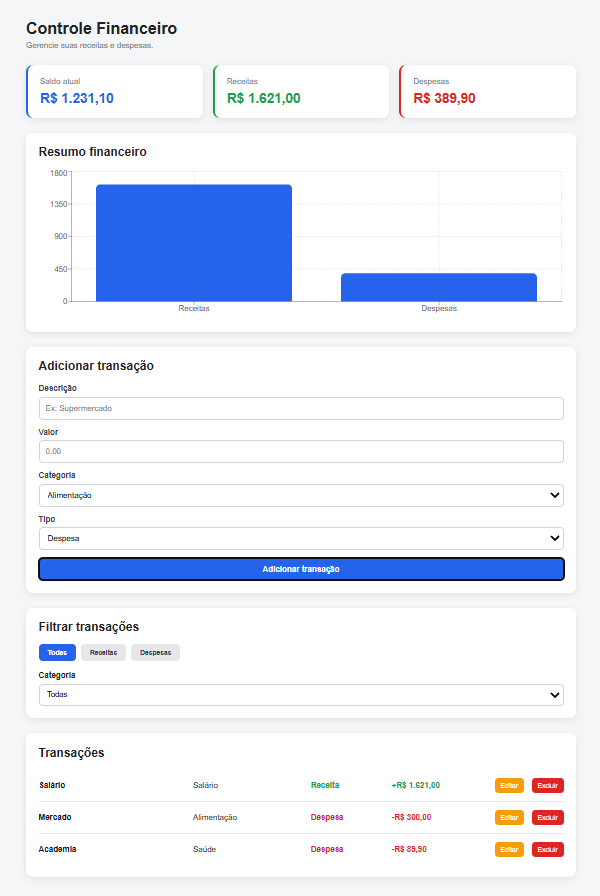

# 💰 Controle Financeiro

Aplicação de controle financeiro desenvolvida com **React**, com foco no gerenciamento de receitas e despesas de forma simples, organizada e responsiva.

O projeto permite cadastrar, editar, excluir e filtrar transações, além de exibir um resumo financeiro com saldo, receitas, despesas e gráfico comparativo.

---

## 📸 Preview



---

## 🚀 Funcionalidades

- Adicionar transações
- Editar transações
- Excluir transações
- Cancelar edição
- Filtrar transações por tipo
- Filtrar transações por categoria
- Cálculo automático de saldo
- Cálculo automático de receitas
- Cálculo automático de despesas
- Persistência dos dados com LocalStorage
- Gráfico comparativo de receitas e despesas
- Formatação de valores em Real Brasileiro
- Layout responsivo para desktop e celular

---

## 🛠️ Tecnologias utilizadas

- React
- JavaScript
- CSS
- Vite
- LocalStorage
- Recharts

---

## 📊 Como funciona

O usuário pode cadastrar uma nova movimentação informando:

- Descrição
- Valor
- Categoria
- Tipo da transação

Exemplo:

```text
Descrição: Supermercado
Valor: 350
Categoria: Alimentação
Tipo: Despesa